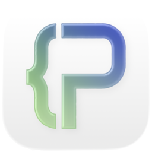

<p align="center">
  
</p>

<h1 align="center">Pseudocode Compiler</h1>

Monorepo for a strict pseudocode toolchain and editor suite. The project ships in two product families:

1. **App**: the native iOS and iPadOS app built with Expo / React Native.
2. **Web**: the Next.js app, which has two different runtime forms:
   - **Desktop app**: an Electron-packaged local app built from `apps/web`.
   - **Browser app**: the web app users open in a browser, including the Vercel deployment.

The desktop app and browser app share most editor UI code, but they are not the same product at runtime. The desktop app is a local app and saves locally. The browser app deployed on Vercel is the only version that uses Clerk authentication and the Convex cloud database for workspace saving. Local web development also saves locally.

The repository includes:

- a shared compiler package that tokenizes, parses, validates, and transpiles pseudocode to Python
- a Next.js app that serves as the local browser UI, Vercel browser UI, and Electron desktop app source
- an Expo React Native app for mobile and iPad layouts
- a shared workspace package for file trees, panel state, layout state, and persistence
- Convex functions for browser cloud workspace sync

## What It Does

- Compiles pseudocode into Python
- Produces syntax and semantic diagnostics with source locations
- Runs generated Python inside an in-browser / in-app Python runtime
- Persists a small multi-file workspace with folders, documents, and virtual files
- Ships a study manual page with worked examples and reference material

## Repository Layout

```text
.
├── apps
│   ├── mobile      # Expo / React Native mobile app
│   └── web         # Next.js web app + Electron desktop packaging
├── convex          # Convex schema/functions for browser cloud sync
├── packages
│   ├── compiler    # Shared compiler core
│   └── workspace   # Shared workspace model and persistence helpers
├── package.json    # Root workspace scripts
└── README.md
```

## Prerequisites

- Node.js 20+ recommended
- pnpm 10+ recommended

Optional, depending on what you want to run:

- Xcode / iOS Simulator for local iOS work
- `eas-cli` for Expo cloud builds
- Vercel CLI for preview deployments and environment variable management

## Product Variants and Persistence

The runtime intentionally treats each product variant differently:

| Variant | Runtime | Persistence | Authentication |
| --- | --- | --- | --- |
| iOS / iPadOS app | `apps/mobile` | Local app storage | None |
| Desktop app | Electron package built from `apps/web` with `BUILD_TARGET=electron` | Local desktop storage | None |
| Local browser app | `http://localhost`, `127.0.0.1`, or `::1` | Browser local storage | None |
| Vercel browser version | Deployed web host | Convex cloud sync | Clerk required |

On deployed web hosts, signed-out users can edit in memory but must sign in before saving to Convex. User profile and account UI are handled by Clerk.

### Desktop App vs Browser App

The desktop app is the Electron-packaged version of `apps/web`. It should behave like an installed local developer tool:

- no Clerk sign-in buttons
- no Convex cloud sync
- local workspace persistence
- built with `BUILD_TARGET=electron`

The browser app is the web version of `apps/web`. It has two modes:

- **Local browser app**: `localhost` development, local browser persistence, no auth requirement.
- **Deployed browser app**: Vercel preview/production URLs, Clerk sign-in required for saving, Convex workspace sync.

When changing persistence or auth behavior, preserve this distinction. Do not make the desktop app depend on Clerk or Convex, and do not let the deployed browser app silently save to local storage instead of requiring sign-in.

Do not reintroduce WorkOS. The browser auth path uses:

- `@clerk/nextjs`
- `clerkMiddleware()` in `apps/web/src/proxy.ts`
- `<ClerkProvider>` via `apps/web/src/lib/auth-components.tsx`
- `await auth()` from `@clerk/nextjs/server` in route handlers

## Getting Started

Install dependencies from the repository root:

```bash
pnpm install
```

Start the main desktop development workflow:

```bash
pnpm dev
```

That launches:

- `next dev` for the web UI
- Electron pointed at the local Next.js server

If you only want the browser app:

```bash
pnpm dev:web
```

Open the web app at [http://localhost:3000](http://localhost:3000).

Local web uses local persistence by design. To test the deployed-browser behavior locally, run a production build/start with Vercel-like environment values.

If you want the Electron shell without keeping the app attached to the launch terminal, start the web server first and then open the desktop window separately:

```bash
pnpm dev:web
pnpm open:desktop
```

## Root Commands

Run these from the repository root:

```bash
pnpm dev             # Web + Electron desktop shell
pnpm dev:web         # Next.js only
pnpm build           # Production web build
pnpm test            # All workspace tests that define test scripts
pnpm test:compiler   # Compiler tests only
pnpm test:web        # Web app tests only
pnpm typecheck       # Type-check all workspaces that support it
pnpm typecheck:mobile
pnpm lint
```

Common verification commands for web changes:

```bash
pnpm --filter @igcse/web typecheck
pnpm --filter @igcse/web test
pnpm --filter @igcse/web build
pnpm --filter @igcse/web lint
```

## App-Specific Commands

### Web / Desktop

```bash
pnpm --filter @igcse/web dev
pnpm --filter @igcse/web dev:web
pnpm --filter @igcse/web dev:electron
pnpm --filter @igcse/web build
pnpm --filter @igcse/web dist   # signed macOS DMG build
pnpm --filter @igcse/web dist:unsigned   # unsigned macOS DMG build
pnpm --filter @igcse/web pack   # unpacked Electron app
```

### Browser Auth and Cloud Sync

The Vercel browser version requires these environment variables:

```bash
NEXT_PUBLIC_CLERK_PUBLISHABLE_KEY=...
CLERK_SECRET_KEY=...
NEXT_PUBLIC_CONVEX_URL=...
WORKSPACE_SYNC_SECRET=...
```

`CONVEX_URL` may be used by server routes as a fallback for `NEXT_PUBLIC_CONVEX_URL`.

Set Clerk and Convex values in Vercel Preview and Production as needed:

```bash
vercel env ls preview
vercel env add NEXT_PUBLIC_CLERK_PUBLISHABLE_KEY preview
vercel env add CLERK_SECRET_KEY preview
```

The app no longer uses WorkOS. Remove stale WorkOS env vars from Vercel when they are no longer needed by older deployments.

### Vercel Deployment

The root `vercel.json` builds the web app:

```json
{
  "framework": "nextjs",
  "installCommand": "pnpm install --frozen-lockfile",
  "buildCommand": "pnpm --filter @igcse/web build",
  "outputDirectory": "apps/web/.next"
}
```

Deploy a preview from the repository root:

```bash
vercel deploy --yes --force
```

After changing environment variables, redeploy so the build and runtime receive the new values.

### macOS Packaging

- `pnpm --filter @igcse/web pack` is the local testing path. It creates an unpacked `.app` in `apps/web/dist/mac-arm64/`.
- `pnpm --filter @igcse/web dist` is for distribution. It now requires a `Developer ID Application` certificate in your macOS keychain.
- `pnpm --filter @igcse/web dist:unsigned` creates a DMG without Developer ID signing. Use this only for manual/local sharing where Gatekeeper warnings are acceptable.
- Without that certificate, Electron can only ad hoc sign the bundle. The app may still start from Terminal, but Finder and Gatekeeper will reject the packaged DMG.

### Mobile

```bash
pnpm --filter @igcse/mobile start
pnpm --filter @igcse/mobile ios
pnpm --filter @igcse/mobile ios:ipad26
pnpm --filter @igcse/mobile android
pnpm --filter @igcse/mobile web
pnpm --filter @igcse/mobile ios:preview
pnpm --filter @igcse/mobile ios:production
pnpm --filter @igcse/mobile ios:testflight
```

## Packages

### `@igcse/compiler`

The compiler package exposes the main compile entry point:

```ts
import { compilePseudocode } from "@igcse/compiler";

const result = compilePseudocode({
  source: `DECLARE Total : INTEGER
DECLARE Index : INTEGER

FOR Index <- 1 TO 3
    Total <- Total + Index
NEXT Index

OUTPUT Total`,
  filename: "main.pseudo",
  strict: true,
});
```

Successful results include generated Python. Failed results include diagnostics and the parsed AST JSON.

Core compiler stages live in:

- `packages/compiler/src/tokenizer.ts`
- `packages/compiler/src/parser.ts`
- `packages/compiler/src/semantics.ts`
- `packages/compiler/src/codegen.ts`

### `@igcse/workspace`

The workspace package contains the shared state model used by both apps:

- folders and pseudocode documents
- panel instances for editor / explorer / terminal / diagnostics / files
- split-layout state
- virtual file storage
- migration helpers for persisted workspace data

## Runtime Notes

- Program execution uses a Python runtime loaded in a worker on web and inside a WebView bridge on mobile.
- The first run may take longer because the Python runtime needs to initialize.
- Execution is guarded by a timeout so runaway programs do not hang the UI indefinitely.

## Manual

The web app includes a built-in manual at `/manual` with:

- exam command words
- loop patterns
- worked pseudocode examples
- copyable snippets

## Testing

Current test coverage in the repo includes:

- compiler unit tests for valid compilation and semantic/syntax failures
- workspace unit tests
- web app component and utility tests

Run everything:

```bash
pnpm test
```

## License

Released under the [GNU General Public License v3.0](./LICENSE).
